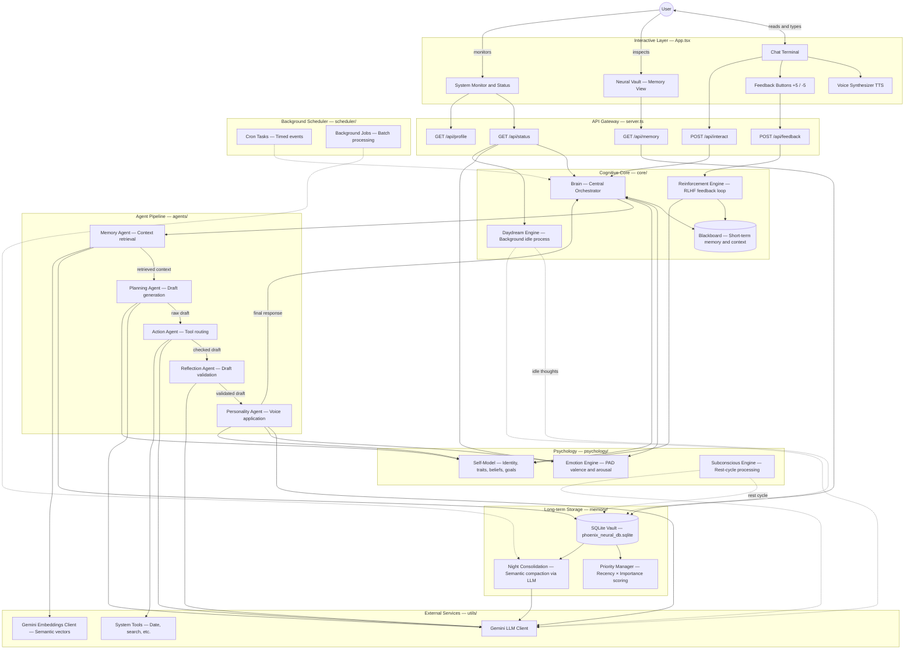

# Phoenix V2 — Architecture Reference

Full architecture diagram for the Phoenix V2 cognitive system.  
This is the reference document for Chapter 2 and Appendix B of *Building Persistent Artificial Intelligence*.

---

## System Architecture Diagram



---

## Component Descriptions

### Brain (`core/brain.ts`)
The central orchestrator. Does not generate responses itself — it coordinates which agent runs when, manages the shared Blackboard, triggers the emotion evaluation after each response, and persists the final output to memory. Manages the system state machine: `offline → initializing → ready → processing`.

### Blackboard (`core/blackboard.ts`)
A volatile key-value store that lives for the duration of a single request. Agents read from and write to it without knowing about each other — the Brain sequences them. Cleared between turns. Keys include: `current_input`, `current_user`, `retrieved_context`, `draft_response`, `reviewed_draft`, `final_output`.

### Agent Pipeline (`core/agents/`)
Five agents run sequentially on every input:

1. **MemoryAgent** — queries the SQLite vault for the most relevant past memories using a hybrid score (semantic similarity × recency × importance). Writes `retrieved_context` to the Blackboard.
2. **PlanningAgent** — builds a raw response draft using the LLM, guided by the system consciousness from `self_model.ts`. Writes `draft_response`.
3. **ActionAgent** — decides whether the draft needs real-world data (current time, a calculation, etc.) and calls a tool if so. Updates `draft_response` if a tool was used.
4. **ReflectionAgent** — reviews the draft for coherence, safety, and rule compliance. Writes `reviewed_draft`.
5. **PersonalityAgent** — applies Phoenix's voice to the reviewed draft. Uses the current emotional state from `emotion.ts` to modulate tone. Writes `final_output`.

### Emotion Engine (`psychology/emotion.ts`)
Implements the PAD (Pleasure-Arousal-Dominance) model. Tracks three continuous dimensions from 0.0 to 1.0. Updated after every interaction based on: response latency (effort), contextual sentiment analysis of the user's input, and energy decay toward a neutral baseline. Persisted in SQLite — survives restarts.

### Self-Model (`psychology/self_model.ts`)
Stores Phoenix's identity, traits, beliefs, and goals in SQLite. Provides the `getPromptContext()` method that generates the system consciousness injected into every LLM call. Can be updated by the ReflectionAgent and SubconsciousEngine as Phoenix evolves through interactions.

### Subconscious Engine (`psychology/subconscious.ts`)
Runs on a background loop every 5 minutes. For each active user: (1) triggers emotional recovery via `emotionEngine.rest()`, (2) runs memory consolidation to compact old memories, (3) generates an anchored reflection using real memories from the vault. This is Phoenix "thinking while you are away."

### Daydream Engine (`core/dreams/daydream_engine.ts`)
Monitors idle time. If no user input arrives within 2 minutes, Phoenix generates a reflective thought about its own memories — a form of unsupervised self-reflection. The daydream is saved to the vault as a new memory with importance 3/10. A `DREAMING...` indicator appears in the UI status bar during this state.

### Memory System (`memory/`)
Three-layer architecture:
- **`storage.ts`** — raw SQLite read/write operations
- **`priority.ts`** — scores memories by recency and importance
- **`memory_manager.ts`** — combines semantic similarity (vector cosine) with priority score to retrieve the most relevant memories for a given query

### Reinforcement Engine (`core/evolution/reinforcement.ts`)
Captures both implicit feedback (sentiment detected in user messages) and explicit feedback (the +5/-5 buttons in the UI). Stores feedback in SQLite with category tagging. Influences the self-model over time based on accumulated scores.

### Incremental Learning (`core/evolution/incremental_learn.ts`)
Monitors interaction patterns (e.g., user consistently requests brevity, or always engages with a specific topic). Extracts these patterns and uses them to update preferences in the self-model.

---

## Data Flow — Single Interaction

```
User types: "What did we talk about yesterday?"
    │
    ▼
POST /api/interact  →  brain.processInput(userInput, userId)
    │
    ├── reinforcement.extractImplicitFeedback(userId, userInput)
    ├── incrementalLearn.analyzeInteraction(userId, userInput)
    │
    ├── Blackboard.write("current_input", "What did we talk about yesterday?")
    ├── Blackboard.write("current_user", userId)
    │
    ├── MemoryAgent.execute()
    │     └── memoryManager.retrieveRelevantContext(userId, query)
    │           ├── embeddings.generateEmbedding(query)  →  Gemini API
    │           ├── storage.loadMemories(userId)          →  SQLite
    │           └── PriorityManager.calculateRelevance()
    │     └── Blackboard.write("retrieved_context", [...memories])
    │
    ├── PlanningAgent.execute()
    │     └── llmClient.generateText(prompt, selfModel.getPromptContext())  →  Gemini API
    │     └── Blackboard.write("draft_response", rawDraft)
    │
    ├── ActionAgent.execute()
    │     └── (checks if a tool call is needed — skips if not)
    │
    ├── ReflectionAgent.execute()
    │     └── llmClient.generateText(draft, reflectionPrompt)  →  Gemini API
    │     └── Blackboard.write("reviewed_draft", checkedDraft)
    │
    ├── PersonalityAgent.execute()
    │     └── llmClient.generateText(checkedDraft, voicePrompt + emotionState)  →  Gemini API
    │     └── Blackboard.write("final_output", finalResponse)
    │
    ├── emotionEngine.evaluateInteraction(userInput, responseTime)
    ├── memoryManager.storeMemory(userId, "Phoenix responded: ...", importance=4)
    ├── subconscious.markUserActive(userId)
    ├── Blackboard.delete("current_input")
    │
    └── return finalResponse  →  HTTP response  →  App.tsx  →  User sees it
```

---

## SQLite Database Schema

The database at `.data/vault/phoenix_neural_db.sqlite` contains these tables:

| Table | Purpose |
|---|---|
| `memories` | All stored interaction content with vectors, timestamps, and importance scores |
| `self_model` | Single JSON row containing the current identity, traits, beliefs, and goals |
| `emotion_state` | Current PAD vector and last-updated timestamp |
| `reinforcement_log` | Individual feedback events with user, reward, category, and context |
| `reinforcement_scores` | Aggregated scores per user per category |
| `subconscious_log` | Records of each subconscious processing cycle |
| `active_users` | Tracks which users have been active recently (for subconscious targeting) |
| `daydream_log` | Records of all daydream events |
| `incremental_patterns` | Learned user behavior patterns |
| `user_profiles` | User identity data managed by `profile_manager.ts` |

---

*This document is the architectural reference. For running the system, see [`SETUP.md`](SETUP.md). For the book chapter that explains each component, see [`chapter-map.md`](chapter-map.md).*
